# Architecture Documentation

> UML diagrams and architectural views for the Multi-Tenant SaaS Platform

## Table of Contents

1. [System Context](#system-context)
2. [Container Diagram](#container-diagram)
3. [Component Diagram](#component-diagram)
4. [Domain Model](#domain-model)
5. [Database Schema](#database-schema)
6. [Sequence Diagrams](#sequence-diagrams)
7. [Deployment Architecture](#deployment-architecture)

---

## System Context

High-level view showing the system and its external dependencies.

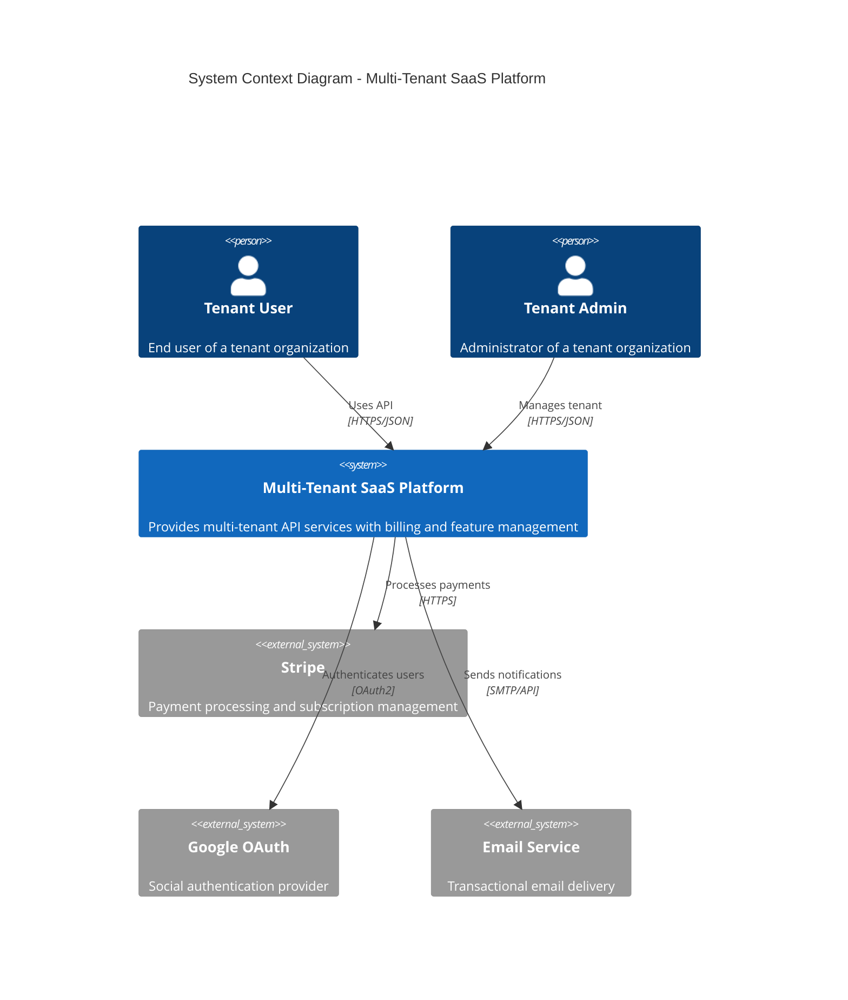

### Simplified System Context

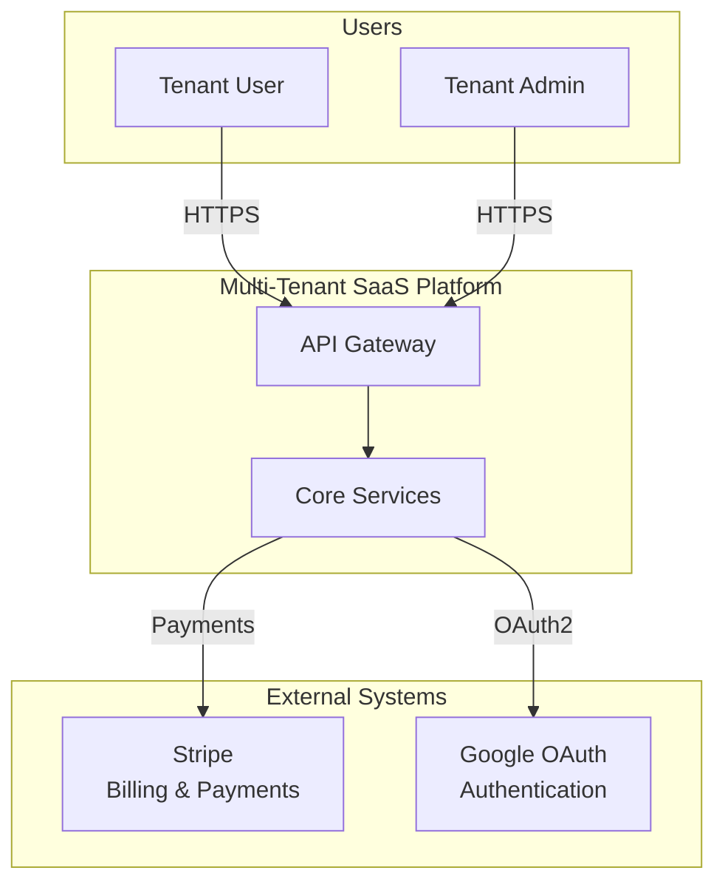

---

## Container Diagram

Shows the high-level technology choices and how containers communicate.

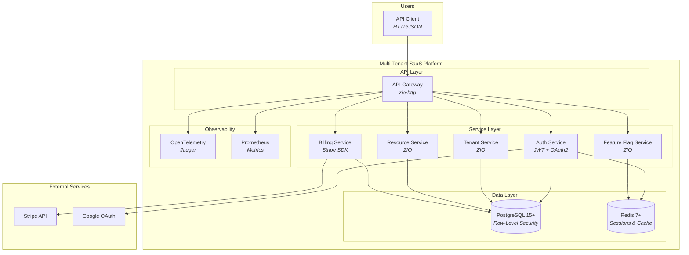

---

## Component Diagram

Detailed view of the API layer components.

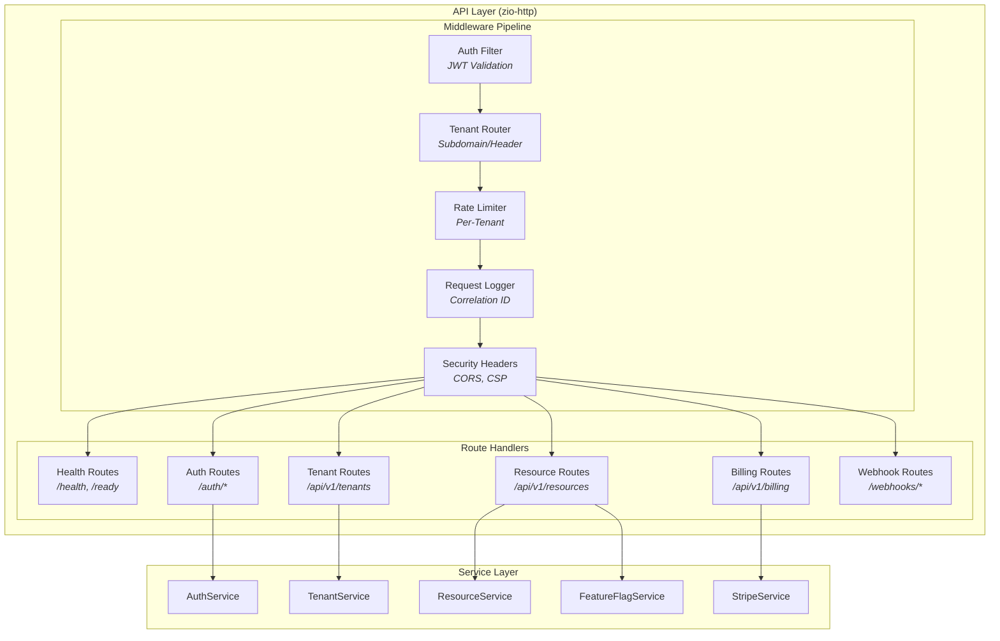

---

## Domain Model

Class diagram showing the core domain entities.

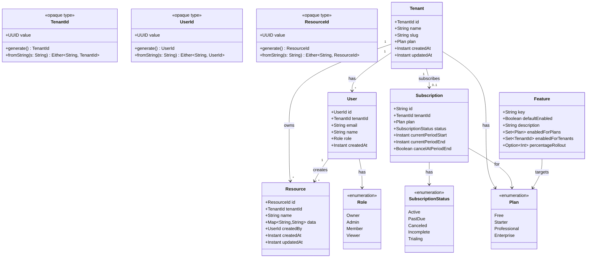

---

## Database Schema

Entity-Relationship diagram for the PostgreSQL database.

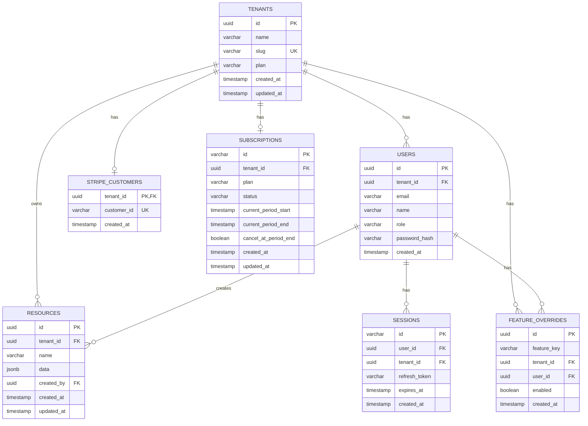

---

## Sequence Diagrams

### Authentication Flow (JWT + OAuth2)

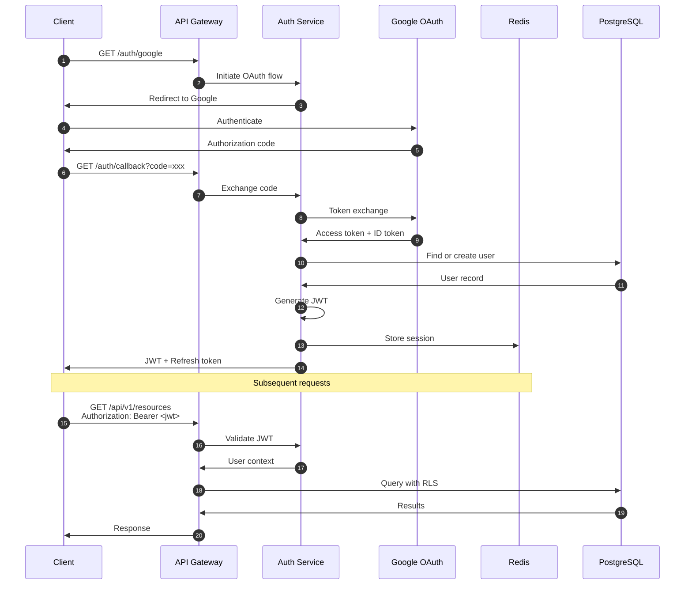

### Multi-Tenant Request Flow

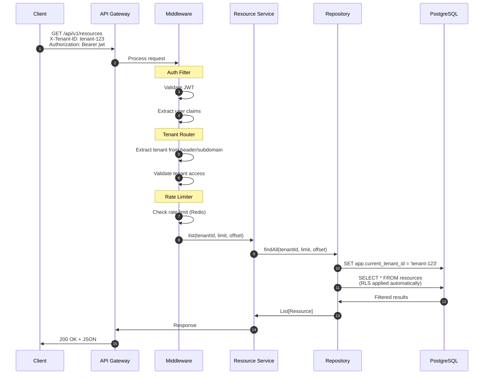

### Stripe Subscription Flow

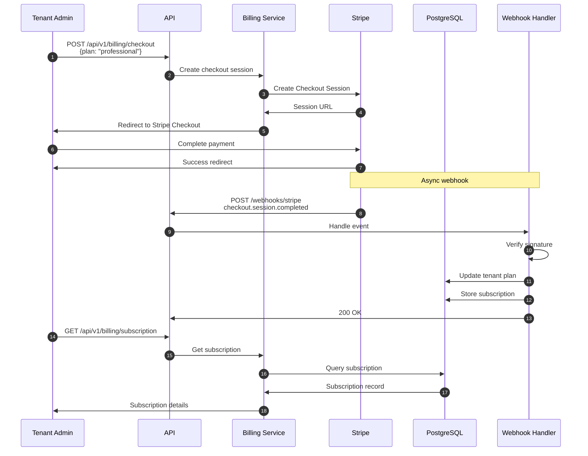

### Feature Flag Evaluation

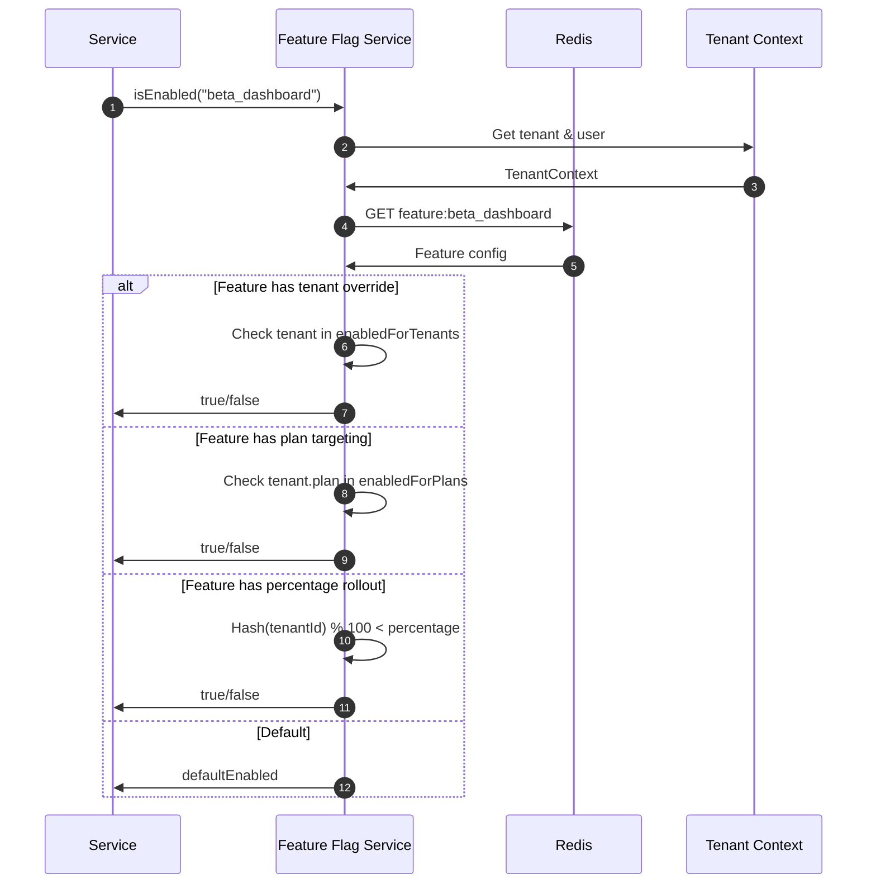

---

## Deployment Architecture

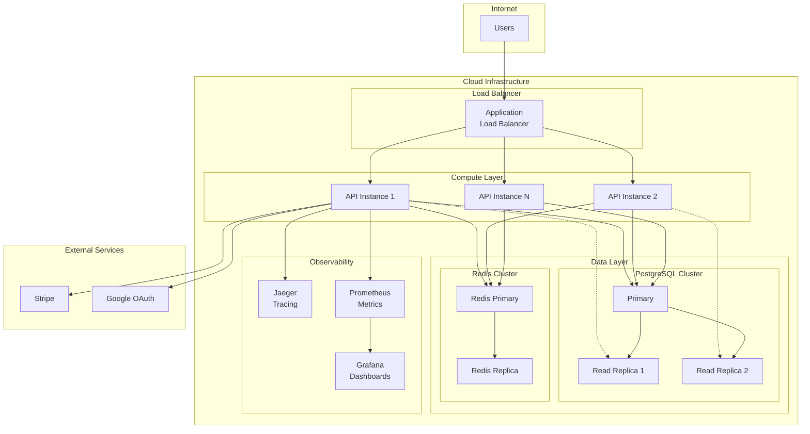

---

## Data Flow: Row-Level Security

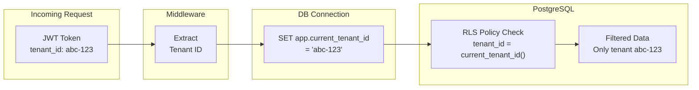

---

## Technology Stack Summary

| Layer | Technology | Purpose |
|-------|------------|---------|
| Language | Scala 3.3.x | Type-safe, functional |
| Effect System | ZIO 2.x | Async, resource management |
| HTTP Server | zio-http 3.x | Native ZIO integration |
| Database | PostgreSQL 15+ | RLS, JSONB |
| Cache | Redis 7+ | Sessions, rate limiting |
| Auth | JWT + OAuth2 | Stateless authentication |
| Billing | Stripe | Subscriptions, usage billing |
| Tracing | OpenTelemetry | Distributed tracing |
| Metrics | Prometheus | Monitoring |
| Containerization | Docker | Deployment |

---

## References

- [C4 Model](https://c4model.com/) - Software architecture diagrams
- [Mermaid](https://mermaid.js.org/) - Diagram syntax
- [PostgreSQL RLS](https://www.postgresql.org/docs/current/ddl-rowsecurity.html) - Row-Level Security
- [ZIO Documentation](https://zio.dev/) - Effect system
